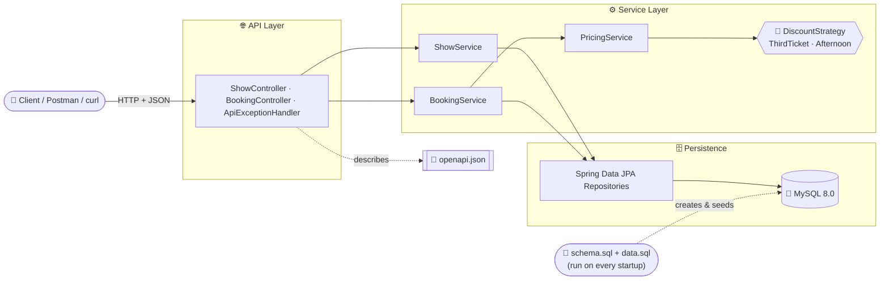
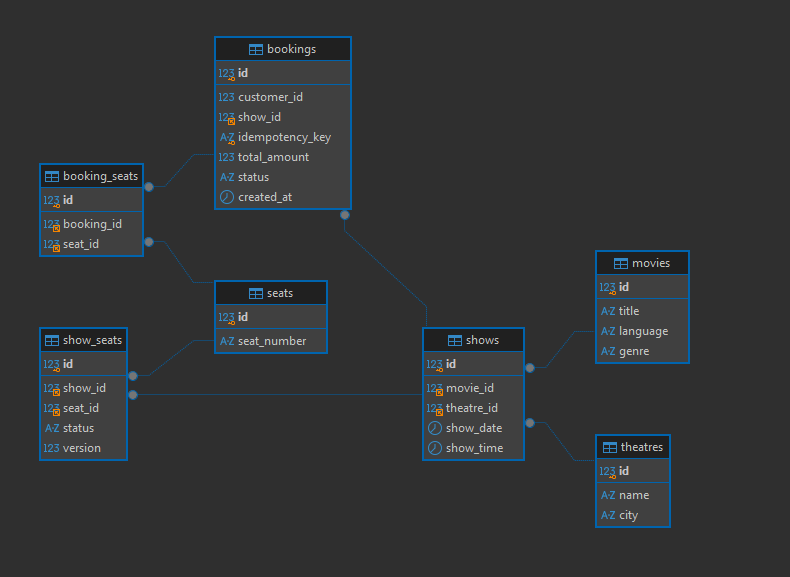
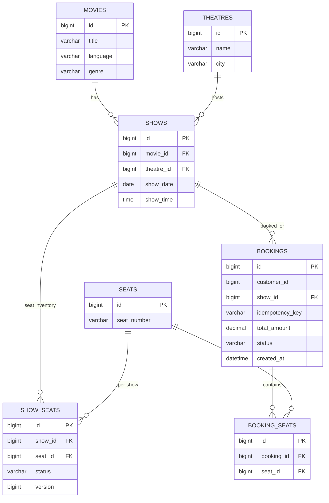

# 🎬 Movie Booking Platform


-2496ED?logo=docker&logoColor=white)


Interview exercise implementation of the XYZ online movie ticket booking platform: a Spring Boot service that lets customers **browse shows** and **book seats**, with pricing offers, seat-level concurrency safety, and idempotent retries built in — backed by **MySQL 8.0**.

---

## 📌 Table of Contents

1. [Overview & High-Level Design](#1-overview--high-level-design)
2. [Run it locally](#2-run-it-locally)
3. [Endpoints — Postman & curl](#3-endpoints--postman--curl)
4. [DB seed / insert script](#4-db-seed--insert-script)
5. [Testing](#5-testing)
6. [CI/CD](#6-cicd)
7. [Design patterns & API contract](#7-design-patterns--api-contract)
8. [Explicitly out of scope](#8-explicitly-out-of-scope)

---

## 1. Overview & High-Level Design

**What it does**

| Scenario | Endpoint | Notes |
|---|---|---|
| 🔍 **Read** — browse theatres/shows for a movie, city & date | `GET /api/v1/shows` | Also the basis for both listed offers |
| 🎟️ **Write** — book seats for a show | `POST /api/v1/bookings` | Idempotent, concurrency-safe, discounts auto-applied |

**Offers implemented:** 50% off the 3rd ticket · 20% off afternoon-show (12:00–17:59) tickets — both stack, computed by `PricingService`.

### Architecture



### Data model



`ShowSeat` (not `Seat`) is the row availability and the optimistic lock (`version`) act on — the same physical seat is independently available/booked per show.

---

## 2. Run it locally

**Requirements:** Java 17+, Maven 3.9+, and **MySQL 8.0 running on `localhost:3306`** with a `root` user whose password is `root` (matches `application.yml` exactly — see below if you'd rather not install MySQL natively).

```bash
mvn spring-boot:run
```

That's it. On startup the app:
1. Connects to `jdbc:mysql://localhost:3306/bookingdb` — the `bookingdb` schema is created automatically (`createDatabaseIfNotExist=true`) if it doesn't already exist.
2. Runs `schema.sql` — drops and recreates every table.
3. Runs `data.sql` — seeds the fixed dataset described in [section 4](#4-db-seed--insert-script) below.

This happens **every time the app starts**, so you always begin from the same known state.

- App: `http://localhost:8080`
- OpenAPI JSON (static file, served as-is): `http://localhost:8080/openapi/openapi.json`
- Swagger UI (generated from the live controllers): `http://localhost:8080/swagger-ui.html`

### Don't have MySQL installed locally?

`docker-compose.yml` starts a MySQL 8.0 container on the same port/credentials (`root`/`root`) the app already expects, so nothing else changes:

```bash
docker compose up -d       # starts MySQL 8.0 in the background
mvn spring-boot:run        # run the app on your host, same as above
docker compose down        # stop it
docker compose down -v     # stop it and wipe the data volume
```

### Quick smoke-test curls

```bash
# Browse shows
curl "http://localhost:8080/api/v1/shows?movieId=1&city=Delhi&date=2026-08-15"

# Book 3 seats on show 2 (15:00, afternoon) — expect total 380.00
curl -X POST "http://localhost:8080/api/v1/bookings" \
  -H "Content-Type: application/json" \
  -H "Idempotency-Key: booking-123" \
  -d '{
    "customerId": 101,
    "showId": 2,
    "seatIds": [1, 2, 3]
  }'
```

---

## 3. Endpoints — Postman & curl

**Import into Postman:** `postman/movie-booking-platform.postman_collection.json` (File → Import). It ships with a `baseUrl` collection variable (defaults to `http://localhost:8080`) and ready-to-run requests for every case below — several hit pre-seeded edge cases directly, so no setup steps are needed before running them.

Full machine-readable contract: [`src/main/resources/static/openapi/openapi.json`](src/main/resources/static/openapi/openapi.json) — also served live at `/openapi/openapi.json`, and browsable via Swagger UI at `/swagger-ui.html` when the app is running.

| # | Request | What it proves |
|---|---|---|
| 1 | `GET /api/v1/shows?movieId=1&city=Delhi&date=2026-08-15` | Browse — 8 shows, 09:00 through 23:00 |
| 2 | `GET /api/v1/shows?movieId=1&city=Mumbai&date=2026-08-15` | City filter — 1 show |
| 3 | `GET /api/v1/shows?movieId=2&city=Bengaluru&date=2026-08-15` | Hindi edition (different `movieId`, same title text) |
| 4 | `GET /api/v1/shows?movieId=3&city=Delhi&date=2026-08-15` | Valid movie, zero shows → empty array |
| 5 | `POST /api/v1/bookings` — show 2, seats `[1,2,3]` | Both discounts stack → **380.00** |
| 6 | `POST /api/v1/bookings` — show 5, seats `[1,2,3]` | Only 3rd-ticket discount → **500.00** |
| 7 | `POST /api/v1/bookings` — show 3 (17:59), seat `[5]` | Afternoon window **included** end edge → **160.00** |
| 8 | `POST /api/v1/bookings` — show 4 (18:00), seat `[6]` | Afternoon window **excluded**, one hour later → **200.00** |
| 9 | `POST /api/v1/bookings` — show 9, seat `[12]` | Last remaining seat on a 2-seat show → **200.00** |
| 10 | `POST /api/v1/bookings` — show 9, seat `[11]` | Pre-booked seat → `409` immediately, no setup |
| 11 | `POST /api/v1/bookings` — show 10, any seat | Fully sold-out show → `409` immediately, no setup |
| 12 | `POST /api/v1/bookings` — same `Idempotency-Key` sent twice | Second call returns the *same* `bookingId` |

**Sample request body** (book tickets):
```json
{
  "customerId": 101,
  "showId": 2,
  "seatIds": [1, 2, 3]
}
```

**curl equivalents** of the same cases:

```bash
# 1. Browse all Delhi shows for movie 1
curl "http://localhost:8080/api/v1/shows?movieId=1&city=Delhi&date=2026-08-15"

# 2. Browse shows - different city
curl "http://localhost:8080/api/v1/shows?movieId=1&city=Mumbai&date=2026-08-15"

# 3. Browse shows - Hindi edition, different movieId
curl "http://localhost:8080/api/v1/shows?movieId=2&city=Bengaluru&date=2026-08-15"

# 4. Browse shows - movie with zero shows
curl "http://localhost:8080/api/v1/shows?movieId=3&city=Delhi&date=2026-08-15"

# 5. Book 3 seats, show 2 (15:00) -> 380.00
curl -X POST "http://localhost:8080/api/v1/bookings" \
  -H "Content-Type: application/json" -H "Idempotency-Key: curl-show2-stack" \
  -d '{"customerId":101,"showId":2,"seatIds":[1,2,3]}'

# 6. Book 3 seats, show 5 (20:00) -> 500.00
curl -X POST "http://localhost:8080/api/v1/bookings" \
  -H "Content-Type: application/json" -H "Idempotency-Key: curl-show5-third-only" \
  -d '{"customerId":105,"showId":5,"seatIds":[1,2,3]}'

# 7. Afternoon window included edge - show 3 (17:59) -> 160.00
curl -X POST "http://localhost:8080/api/v1/bookings" \
  -H "Content-Type: application/json" -H "Idempotency-Key: curl-show3-edge" \
  -d '{"customerId":103,"showId":3,"seatIds":[5]}'

# 8. Afternoon window excluded edge - show 4 (18:00) -> 200.00
curl -X POST "http://localhost:8080/api/v1/bookings" \
  -H "Content-Type: application/json" -H "Idempotency-Key: curl-show4-edge" \
  -d '{"customerId":104,"showId":4,"seatIds":[6]}'

# 9. Mini show - last remaining seat -> 200.00
curl -X POST "http://localhost:8080/api/v1/bookings" \
  -H "Content-Type: application/json" -H "Idempotency-Key: curl-show9-last-seat" \
  -d '{"customerId":107,"showId":9,"seatIds":[12]}'

# 10. Mini show - already-booked seat -> 409 immediately
curl -i -X POST "http://localhost:8080/api/v1/bookings" \
  -H "Content-Type: application/json" -H "Idempotency-Key: curl-show9-conflict" \
  -d '{"customerId":108,"showId":9,"seatIds":[11]}'

# 11. Fully sold-out show -> 409 immediately
curl -i -X POST "http://localhost:8080/api/v1/bookings" \
  -H "Content-Type: application/json" -H "Idempotency-Key: curl-show10-conflict" \
  -d '{"customerId":109,"showId":10,"seatIds":[1]}'

# 12. Idempotent retry - run this exact command twice
curl -X POST "http://localhost:8080/api/v1/bookings" \
  -H "Content-Type: application/json" -H "Idempotency-Key: curl-fixed-key-001" \
  -d '{"customerId":111,"showId":6,"seatIds":[8]}'
```

---

## 4. DB seed / insert script

Table creation and data seeding are both plain SQL, run automatically by Spring Boot **on every application startup** (`spring.sql.init.mode=always` in `application.yml`) — there is no separate manual step:

- [`src/main/resources/schema.sql`](src/main/resources/schema.sql) — drops and recreates every table (MySQL 8.0 DDL, matching the JPA entity mappings exactly; `spring.jpa.hibernate.ddl-auto=none` so Hibernate never touches the schema itself).
- [`src/main/resources/data.sql`](src/main/resources/data.sql) — inserts the seed dataset, deliberately including edge cases, not just a happy path:

| Show ID | Time | Date | City | Movie | Notes |
|---|---|---|---|---|---|
| 1 | 12:00 | 08-15 | Delhi | Interstellar (EN) | Afternoon window — **included** start edge |
| 2 | 15:00 | 08-15 | Delhi | Interstellar (EN) | Afternoon window — mid; primary documented example |
| 3 | 17:59 | 08-15 | Delhi | Interstellar (EN) | Afternoon window — **included** end edge (still hour 17) |
| 4 | 18:00 | 08-15 | Delhi | Interstellar (EN) | Afternoon window — **excluded**, one hour after show 3 |
| 5 | 20:00 | 08-15 | Delhi | Interstellar (EN) | Evening, no discount; primary documented example |
| 6 | 09:00 | 08-15 | Delhi | Interstellar (EN) | Morning, no discount |
| 7 | 16:00 | 08-15 | Mumbai | Interstellar (EN) | Same movie/date, different city |
| 8 | 15:00 | 08-16 | Delhi | Interstellar (EN) | Same movie/theatre, different date |
| 9 | 22:00 | 08-15 | Delhi | Interstellar (EN) | **Mini 2-seat show** (`BAL1`/`BAL2`) — `BAL1` pre-booked |
| 10 | 23:00 | 08-15 | Delhi | Interstellar (EN) | **Fully sold out** — all 10 seats pre-booked |
| 11 | 15:00 | 08-15 | Bengaluru | Interstellar (**Hindi**, `movieId=2`) | Same title text, different `movieId` |

Movie `id=3` ("The Silent Echo") intentionally has **zero shows anywhere** — a valid `movieId` that should return an empty list, not an error. Two `Booking`/`BookingSeat` rows back the pre-booked seats above, so the data is referentially realistic end-to-end, not just flags set on `show_seats`.

⚠️ Because `schema.sql` drops every table on each startup, this data resets every time you restart the app — that's the point (requirement: *"insert into MySQL as soon as the application starts, every time"*), but it does mean any bookings you make while testing are gone on the next restart.

---

## 5. Testing

Both scenarios are covered by integration tests that boot the full Spring context against a disposable **Testcontainers MySQL 8.0** instance, driving the real HTTP layer via MockMvc — `schema.sql`/`data.sql` run exactly as they do against your local MySQL, so the same fixed seed IDs (and edge cases) are available in every test run:

- `ShowReadScenarioIntegrationTest` — browse by movie/city/date, case-insensitive city, city/date filtering, `movieId` vs title-text isolation, and the zero-shows movie.
- `BookingWriteScenarioIntegrationTest` — discount stacking, both afternoon-window boundary edges (17:59 included vs 18:00 excluded), the mini show's last-remaining-seat and pre-booked-seat cases, the fully-sold-out show, and idempotent retries.

```bash
mvn test          # requires Docker running locally
```

---

## 6. CI/CD

Two GitHub Actions workflows ship in `.github/workflows/`:

- **`ci.yml`** — on every push/PR to `main`: builds with Maven and runs the full Testcontainers suite (GitHub-hosted runners have Docker preinstalled, so this is a real run, not a skip). On a successful push to `main`, it also builds and publishes the Docker image to **GitHub Container Registry** (`ghcr.io/<repo>:latest`) — free, GitHub-native, no extra secrets needed.

  > Note: GitHub doesn't offer a free *hosting* environment for a backend Spring Boot service (GitHub Pages is static-content only). GHCR gets you a versioned, pullable image; actually running it still needs a host (Render, Fly.io, a VM, etc.) **and** a reachable MySQL instance.

- **`notify-slack.yml`** — on every push, posts a short message (author, branch, commit, link) to a Slack channel via an Incoming Webhook. Add your webhook URL as a repo secret named `SLACK_WEBHOOK_URL` (Settings → Secrets and variables → Actions) — see the comments at the top of the workflow file. Without the secret set, the workflow logs a note and exits cleanly rather than failing.

---

## 7. Design patterns & API contract

- **Strategy** — `DiscountStrategy` implementations are independently pluggable; `PricingService` just sums whatever's registered.
- **Repository** — standard Spring Data `JpaRepository` interfaces isolate persistence from the service layer; no custom DAO code.
- **DTO / API-model separation** — controllers only see `api.*` records, never JPA entities.
- **Optimistic locking** — `ShowSeat.version` protects seat inventory under concurrent booking requests.
- **Idempotency-key** — `POST /api/v1/bookings` is safe to retry.
- **Centralised exception translation** — `ApiExceptionHandler` maps domain exceptions to HTTP status/error body consistently.
- **SQL-owned schema** — `schema.sql`/`data.sql` are the single source of truth for the database; Hibernate (`ddl-auto=none`) never creates, alters, or validates it.

---

## 8. Explicitly out of scope

Per the exercise's own "you can skip solution areas you're not comfortable with" note:

- Other write scenarios (theatre show CRUD, bulk booking/cancellation, seat-inventory allocation APIs) — one write scenario was implemented as asked; open for discussion.
- Payment gateway integration — the flow stops at booking confirmation.
- AuthN/AuthZ, rate limiting, and the broader non-functional/platform topics (multi-city/country scaling, 99.99% availability, OWASP Top 10, compliance, hosting/sizing, monitoring, release management) are architecture-discussion topics per the brief, not implemented in code here.
